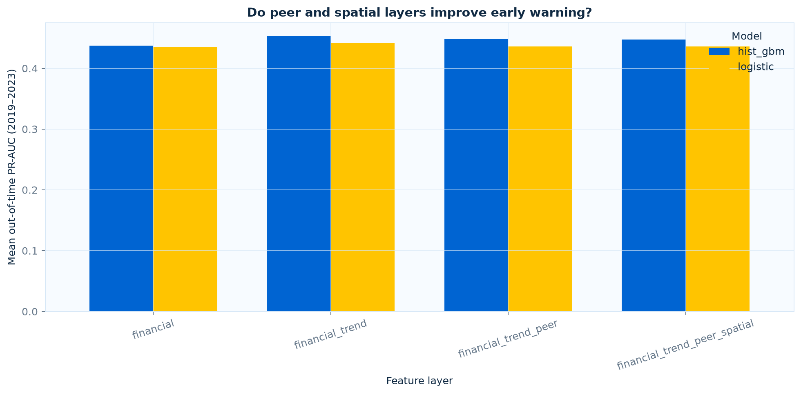
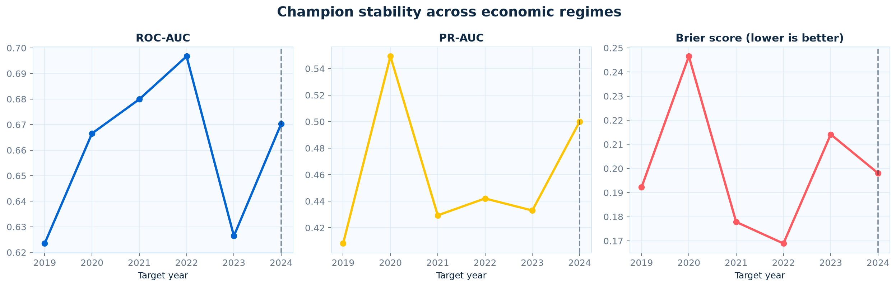
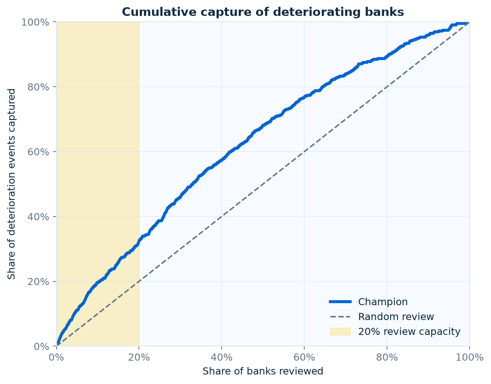
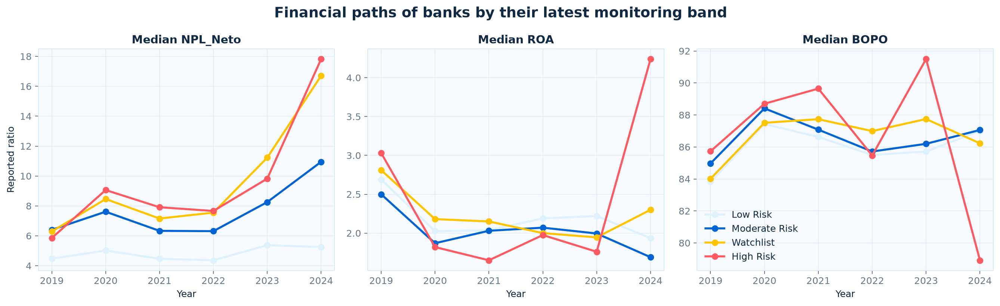
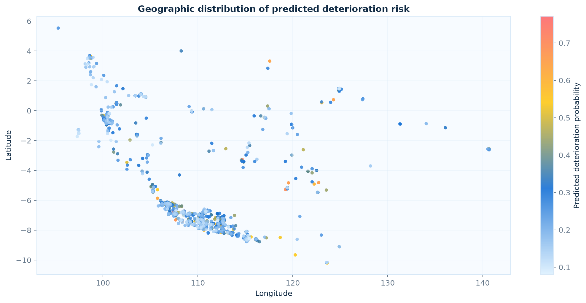

<div align="center">

# BPR Financial Distress Early Warning

### Financial deterioration → early warning → risk prioritization

An out-of-time banking-risk study using scraped OJK financial statements for Indonesian conventional BPRs.



</div>

## Business question

> Can we identify BPRs showing signs of financial deterioration one year ahead using their financial condition, historical trajectory, regional peers, and nearby banks?

This is an early-warning system, not a generic ratio dashboard and not a Kaggle-style accuracy exercise. It prioritizes banks for review, explains the signals behind each flag, tests whether geographic information adds value, and measures performance strictly out of time.

The repository does **not** contain verified default, liquidation, license-revocation, or supervisory-distress events. The modeled outcome is therefore named precisely: `probability_of_next_year_deterioration`. It must not be interpreted as probability of default.

## Headline results

| Result | Value |
|---|---:|
| Development/model-selection period | Target years 2019–2023 |
| Locked final holdout | Target year 2024 |
| Champion | Histogram gradient boosting |
| Champion inputs | Bank financial condition + temporal trends |
| 2024 ROC-AUC | **0.670** |
| 2024 PR-AUC | **0.500** |
| 2024 Brier score | **0.198** |
| 2023 NPL-net Moran's I | **0.058** |
| Moran permutation p-value | **0.001** |

Financial trends improve early-warning performance. Geographic dependence is statistically detectable but weak: adding administrative peer and coordinate-spatial features does not improve development-period PR-AUC over the financial-plus-trend champion. Spatial context is therefore retained for monitoring and explanation rather than forced into the production score.

## Monitoring views

| Model stability | Event capture |
|---|---|
|  |  |

| Financial deterioration paths | Geographic risk context |
|---|---|
|  |  |

Additional monitoring artifacts cover target stability, calibration, risk deciles, risk migration, review-capacity bands, global importance, local peer comparison, and province-level context. All figures use a tiket.com-inspired blue/yellow visual system with coral reserved for high-risk signals.

## Forward target

For bank `i` observed at year `t`, the label is realized at `t+1`. Four auditable component events are calculated:

- NPL net increases by at least 2 percentage points;
- ROA decreases by at least 1 percentage point;
- BOPO increases by at least 5 percentage points; and
- KPMM decreases by at least 5 percentage points.

`next_period_deterioration = 1` when at least two components deteriorate. All four ratios must exist at both endpoints. Individual component flags and changes remain in the analytical panel for auditability.

These thresholds describe material financial movement and broadly align with adverse upper-quartile historical changes. They are not regulatory distress thresholds. Sensitivity testing should precede operational use.

## Analytical design

```text
OJK annual statements
        │
        ▼
Panel and identity validation ──► explicit 2024 unit repair flag
        │
        ▼
Bank condition + historical trends
        │
        ├──► administrative peer features, leave-one-bank-out
        ├──► 8-nearest-bank spatial features at time t
        └──► regional enrichment interface, currently unpopulated
        │
        ▼
Expanding out-of-time validation by target year
        │
        ├──► interpretable logistic regression
        └──► histogram gradient boosting benchmark
        │
        ▼
Calibration + KS + PR-AUC + lift + risk deciles
        │
        ▼
Bank risk table + monitoring bands + evidence-based drivers
```

### Feature layers

1. **Financial:** NPL net, ROA, BOPO, LDR, KPMM, cash ratio, asset/loan scale, equity-to-assets, provision coverage, and funding structure.
2. **Trend:** one-year changes, asset/loan/deposit growth, loan growth versus deposit growth, three-year slopes, and deviations from expanding bank history.
3. **Peer:** leave-one-out city/regency averages, peer deterioration share, own-versus-peer deviation, peer percentile, and peer support count.
4. **Spatial:** same-year k-nearest-bank averages, peer deterioration share, neighbor coverage, and coordinate-quality flags.
5. **Regional:** deliberately omitted until point-in-time BPS/OJK regional data are sourced.

### Temporal validation

Random cross-validation is not used. Every fold trains on earlier target years and validates on the next unseen year.

| Fold | Training target years | Validation target year | Interpretation |
|---:|---|---:|---|
| 1 | 2016–2018 | 2019 | Reporting-schema boundary stress test |
| 2 | 2016–2019 | 2020 | COVID-era shift |
| 3 | 2016–2020 | 2021 | Out-of-time validation |
| 4 | 2016–2021 | 2022 | Out-of-time validation |
| 5 | 2016–2022 | 2023 | Final development fold |
| Final | 2016–2023 | 2024 | Locked holdout |

Model selection uses mean development-period PR-AUC. The 2024 outcome is used only after the champion model and feature layer are chosen.

## Risk-oriented evaluation

The experiment reports:

- ROC-AUC and PR-AUC;
- KS statistic;
- Brier score and calibration curve;
- recall and precision in the top 20% review population;
- top-20% lift;
- realized deterioration rate by risk decile;
- cumulative event capture; and
- annual stability and risk-band migration.

Risk bands encode an explicit monitoring-capacity assumption:

| Band | Portfolio share | Intended action |
|---|---:|---|
| High Risk | Top 5% | Immediate analyst review |
| Watchlist | Next 15% | Enhanced monitoring |
| Moderate Risk | Next 30% | Routine trend review |
| Low Risk | Bottom 50% | Standard monitoring |

These are prioritization bands, not supervisory grades.

## Explainability

Global importance is calculated by holdout permutation using PR-AUC. Bank-level explanations use median-replacement perturbations against the training population: a positive contribution means the observed feature raises predicted deterioration probability relative to its training median.

The final risk table combines:

- latest financial ratios;
- financial trends;
- predicted deterioration probability;
- capacity-based risk band;
- model-derived top risk drivers;
- city/regency and spatial peer indicators; and
- data-quality and shared-coordinate flags.

## Repository map

```text
xcap/
├── Client-BPRSK/                  # Legacy notebooks and retained scraped data
├── docs/
│   └── data_audit_and_modeling_plan.md
├── notebooks/
│   ├── 01_data_audit_and_target_design.ipynb
│   └── 02_early_warning_modeling.ipynb
├── outputs/
│   ├── figures/
│   ├── latest_bank_risk_table.csv
│   ├── model_metrics_by_year.csv
│   ├── out_of_time_predictions.csv
│   └── ...
├── scripts/
│   └── run_modeling.py
├── src/xcap_ews/
│   ├── config.py
│   ├── data.py
│   ├── evaluation.py
│   ├── explain.py
│   ├── features.py
│   ├── spatial.py
│   ├── target.py
│   └── visualization.py
├── tests/
│   └── test_core.py
├── pyproject.toml
└── uv.lock
```

## Run locally

The project uses Python 3.10+ and `uv` for a locked, reproducible environment.

```bash
git clone https://github.com/zzeiidann/xcap.git
cd xcap
uv sync
uv run pytest -q
uv run python scripts/run_modeling.py
uv run jupyter lab
```

Both portfolio notebooks are stored with executed outputs:

- [`01_data_audit_and_target_design.ipynb`](notebooks/01_data_audit_and_target_design.ipynb)
- [`02_early_warning_modeling.ipynb`](notebooks/02_early_warning_modeling.ipynb)

## Output contract

| Artifact | Purpose |
|---|---|
| `latest_bank_risk_table.csv` | Bank review queue with probabilities, bands, drivers, trends, peers, and quality flags |
| `model_metrics_by_year.csv` | Fold-level performance for every model and ablation |
| `ablation_summary_development.csv` | Development-period incremental feature value |
| `out_of_time_predictions.csv` | Observation-level predictions generated only from earlier training periods |
| `champion_risk_deciles.csv` | Realized event rate and lift by risk decile |
| `champion_risk_migration.csv` | Transition rates between monitoring bands |
| `final_holdout_permutation_importance.csv` | Global importance on the locked holdout |
| `spatial_diagnostics.csv` | Moran's I and permutation-test result |
| `run_metadata.json` | Seed, champion-selection rule, holdout result, and target semantics |

## Data-quality findings

The project makes limitations visible instead of silently cleaning them away:

- the panel is a pseudo-balanced skeleton created from one bank roster;
- unavailable reports and parser failures cannot always be separated in legacy exports;
- 2024 monetary fields exhibit an approximately 1,000-fold unit discontinuity;
- the current repair divides 2024 monetary values by 1,000 and records a flag, pending raw OJK unit verification;
- conventional NPL gross is systematically unreliable in 2019–2022;
- some ratios have implausible tails and are surfaced through review flags;
- 241 bank rows share exact coordinates, including two very large coordinate clusters;
- geocodes lack a source address, precision class, and match confidence;
- BPRS contains duplicate identities and incompatible historical schemas, so it is excluded from the primary model; and
- no genuine adverse-event or regional macroeconomic dataset is currently included.

The detailed audit, leakage register, and implementation gates are documented in [`docs/data_audit_and_modeling_plan.md`](docs/data_audit_and_modeling_plan.md).

## Responsible interpretation

This project supports analyst prioritization. It does not replace supervisory judgment, establish causality, or certify that a bank is distressed. A high score means the fitted model sees a greater likelihood of the defined next-year financial-deterioration pattern, subject to the quality and availability of the retained OJK extracts.
